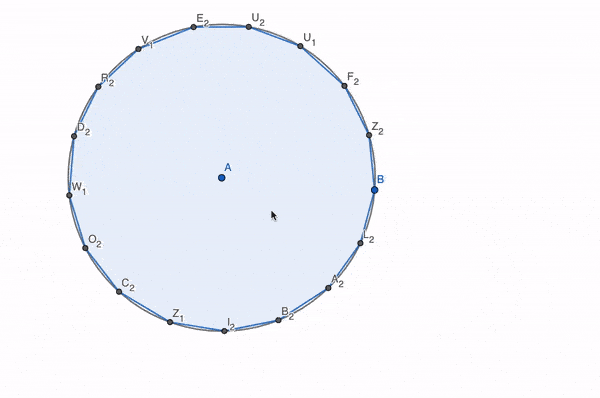

# Academics

## Current Work

### Doctorate of Physics

My focus is within the realm of Computational Astrophysics and Radio Cosmology. With my PhD thesis specifically focusing on simulating the interferometer response of the SKA-Low telescope given a HI simulation of the Epoch of Reionization. Then analysing how changing input and configuration parameters affect resulting observables like the 21 cm power spectrum, 21 cm forest observations, and cross-correlations between HI and line intensity maps. I'm working with [Prof. Cathryn Trott](https://orcid.org/0000-0001-6324-1766) at Curtin University on software and telescopes ranging from [OSKAR](https://github.com/OxfordSKA/OSKAR) the [Murchison Widefield Array](https://www.mwatelescope.org) (MWA), and [SKA-low](https://www.skao.int/en/explore/telescopes/ska-low).

### Tutoring

I generally tutor at a university level in the fields of Astronomy, Physics, Mathematics, and Computer Science. Of course, this is mainly in the vein of keeping my résumé nice and full, as well as training myself for an eventual future in more substantial teaching.

High-school tutoring is something I've also done in the past, but generally, I prefer higher-level topics. While dealing with children can often be exhausting, it's really not the gap in maturity I have a problem with – it's the parents. So many of them are so controlling and obsessive that it can become really difficult to actually help the student learn. It's why I don't really tutor high school any more.

## Past Research, Academics, & Major Works

### Honours Thesis

I have a bachelor's degree in science with first class honours from the Australian National University in Canberra — of which I graduated in December 2024. During my degree, I majored in Astronomy and minored in Computer Science. My honours' thesis there was focused on the magnetic draping effect applied to High Velocity Clouds (HVCs) in the [Circumgalactic Medium (CGM)](https://en.wikipedia.org/wiki/Warm-hot_intergalactic_medium) — working with (Prof. Naomi McClure-Griffiths)[https://orcid.org/0000-0003-2730-957X] and [Dr. Craig Anderson](https://orcid.org/0000-0002-6243-7879) at the Mt. Stromlo Observatory. I primarily relied on data from the [Australian Square Kilometre Array Pathfinder](https://www.csiro.au/en/about/facilities-collections/atnf/askap-radio-telescope) (ASKAP)'s [Polarisation Sky Survey of the Universe's Magnetism](https://possum-survey.org) (POSSUM).

### 3rd Year Research

I also worked for a semester with [Dr. Brad Tucker](https://orcid.org/0000-0002-4283-5159) and [Prof. Christopher Lidman](https://orcid.org/0000-0003-1731-0497) on the [Dark Energy Bedrock All-Sky Survey](https://www.mso.anu.edu.au/debass/) (DEBASS). This survey sought to follow up on low redshift type Ia supernovae — following up on the [Dark Energy Survey](https://en.wikipedia.org/wiki/Dark_Energy_Survey) (DES) made prior to 2021.

### University Academics

There were many more interesting courses and learning experiences across my degree. In Physics, I learnt both General Relativity and Quantum Field Theory, and in Astronomy, I have also learnt Magnetohydrodynamics and other phenomena like Cosmic Rays. This contributes to a very wide portfolio of knowledge in the realm of Physics and Astronomy – and it has been extremely useful in my career.

Next to Astrophysics, Computer Science is my next favourite subject — which I have always had a soft spot for. My favourite parts of CS are mainly theoretical components. Logic, programming paradigms, and automata — I spend some of my spare time coming up with new programming language concepts and learning new computer languages. However, I can always appreciate good software design — and have a keen eye for such things. In 2022, I took a course on “Computer Organisation and Program Execution” — all about how a computer works on the nitty-gritty levels including teaching assembly itself.

### High-School Academics

Speaking of High School, I attended [The Scots College](https://scots.college) in Sydney — graduating from there in October 2020. While it was a private school I honestly think that any public school is capable of giving students a great education. I don't feel the need to discuss my accolades back then — it should be clear that I was a good student. However, just for the sake of it my (ATAR)[https://www.sydney.edu.au/study/applying/how-to-apply/undergraduate/atar-explained.html] was 98.35 — reminder that I spent my Year 12 in the middle of the 2020 COVID-19 lockdowns.

The subjects I did in Y11/12 High School was:
<table style="white-space: nowrap; table-layout: unset;">
<thead>
	<tr>
		<th>Units</th>
		<th>Subject Name</th>
	</tr>
	<tr><td colspan="2">
</td></tr>
</thead>
<tbody>
	<tr>
		<td>2</td>
		<td>English Advanced (Compulsory)</td>
	</tr>
	<tr>
		<td>4</td>
		<td>Extension 2 Mathematics</td>
	</tr>
	<tr>
		<td>2</td>
		<td>Physics</td>
	</tr>
	<tr>
		<td>2</td>
		<td>Chemistry</td>
	</tr>
	<tr>
		<td>2</td>
		<td>Software Design and Development</td>
	</tr>
	<tr>
		<td>1</td>
		<td>Science Extension</td>
	</tr>
</tbody>
<tfoot>
	<tr><td colspan="2">
</td></tr>
	<tr>
		<td>13</td>
		<td>Total</td>
	</tr>
</tfoot>
</table>

### Personal Academics

For my entire life, I have always done extra academic work beyond the normal boundaries for school. In more recent years this has involved doing geometry, classical physics, and programming in my spare time. But back in high school and primary school I self-taught myself a lot of mathematics and physics. Examples include teaching myself web design, or C++, or how to create an RSS feed, etc.

My favourite thing I did was back in 2021 where I constructed a Heptadecagon using only ruler and compass (in GeoGebra's geometry tool). Here's a GIF:

In Y11 for example, I spent a few months teaching myself multivariable and vector calculus. And in Y12 I extended that to learning about Maxwell's equations. In Y8 I taught myself complex numbers and in Y5/6 I taught myself vector algebra and solving equations.

### Science Extension Research

In High school I did a bit of research as well. My HSC Science Extension research project initially was going to be about using lasers and the electromagnetic model of light to calculate the speed of light, working with [Dr. Boris Kuhlmey](https://orcid.org/0000-0002-8732-8900) from Sydney University. But unfortunately due to the pandemic I had to switch gears and use legacy data from an interferometric optical autocorrelator, measuring the speed of light in a piece of Soda-Lime glass and comparing it to an in-school setup.

### Software Design

One of my other major projects was for Software Design Development — in the form of an Express.js web application called 'ReactIt!'. It was meant to pull together my knowledge of Chemistry and my interest in computing to make a prototype of something worth sharing with the world.

One of my other projects that I'm particularly proud of was my text-based video game, Critical Statum: Contagion. Eventually I hope to make an updated version in C# because the current version is a bit broken and also is extremely messy, mainly because it was *very early* in my programming career.

I also at one point tried making a Solitaire game called 'Solitaire for One'. But I never got around to it and stuck to the assessment requirements instead – that being making a Blackjack game.

### Other Research

Back in Y11 I did a research project that was more history-oriented, focusing on the Space Race. It was meant to be more about the potential development of the private space industry. Honestly it's fascinating re-reading over that document because I've very much evolved both politically and socially as a person in-comparison to my 16-yo self. Suffice it to say it kinda doesn't age well, but at the same time it really does, thanks to the rather inevitable direction of the public-private partnership.

## Future Ambitions

My intention is to stay within the academic and teaching space as a career. For quite a while I have wanted to be a professor and researcher, teaching the next generation and contributing to our collective knowledge of the cosmos and physics itself. I want to remain teaching in mathematics, physics, astronomy, and computer science, and be a loud advocate for better scientific communication and education. As well as an activist in other areas. But I still want to divide my time evenly between education and research, research focused specifically on Radio Cosmology and Computational Astrophysics, perhaps with a more specific focus on 21 cm Forests and Line Intensity Mapping.

## Learning in Other Fields, and Past Diversions

I'm always one to enjoy learning more. I've considered so many directions to go over the years.

While I have *always* desired to be an astrophysicist since I first ever picked up my first book, I've had my flings with other occupations. All of which have informed who I am today and what I like. Here's just a list of some jobs and/or qualifications I've considered doing/getting, ordered from most desired/realistic now to least:
- Optical Physics
- Software Design/Information Technology
- Politics/Activism
- Law/Public Legal Defence
- Audio Visual
- Creative Writing (Poetry/Short Stories)
- Music (Rock, Brass, Singing, Dancing)
- Sportsperson (Hockey, Tennis)
- Cybersecurity/Hacktivism
- Pharmaceuticals

## Other Work

### Software Design

I've had a small career as a software developer. I learnt most of my skills in HSC Software Design and Development, and put those skills to the test at both [NextGen](https://nextgen.group) Distribution in Sydney and [Agile Digital Engineering](https://agiledigital.com.au) in Canberra.

## Extracurricular Work in High-School

I also did some fun and interesting things during my time in High School, including being the Captain of the Audio Visual department, learning the trumpet and the drums. I also did the [Duke of Edinburgh](https://dukeofed.com.au) — Bronze, Silver, and Gold — which is how I came to love hiking and cycling.

In 2017, I went to [Glengarry](https://scots.college/visit-scots/campuses/glengarry), which was an outdoor education facility in Kangaroo Valley run by my high school. There I learned a lot of life and survival skills (and also got extremely fit).

### Hospitality

My earliest work was at one of my local restaurants in Discovery Bay, Hong Kong, called 'Zaks'. Unfortunately I believe it's now been closed indirectly due to the slow encroachment of China into Hong Kong. But back when it was still operational it was a massive restaurant, serving up to 3000 people a day.
